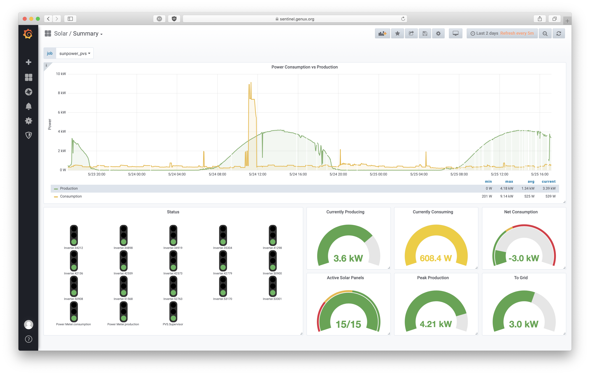
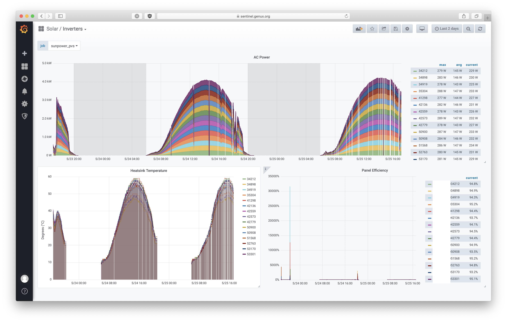
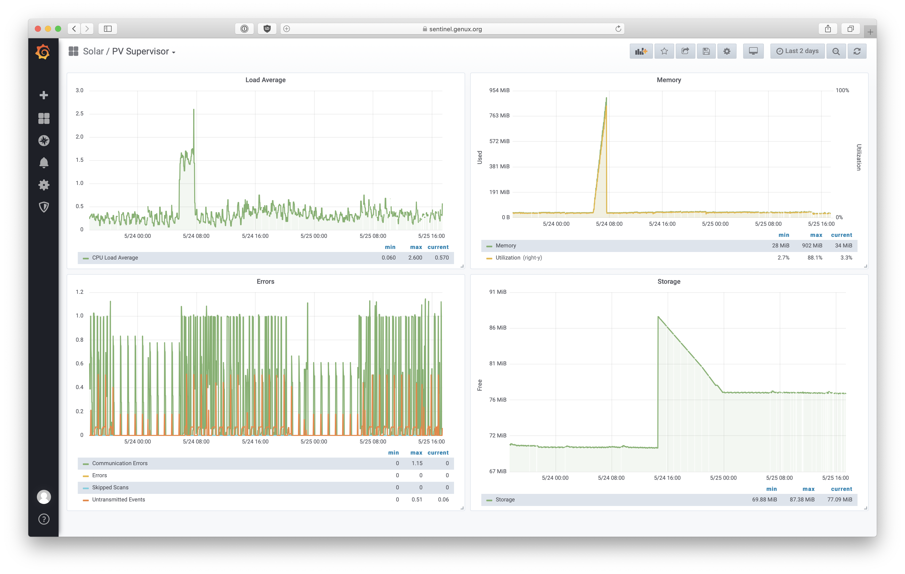

About
=====

[](https://travis-ci.org/ginoledesma/sunpower-pvs-exporter)
[](https://codecov.io/gh/ginoledesma/sunpower-pvs-exporter)

A Prometheus exporter for the SunPower ProVision monitoring system:

- SunPower PVS 5x
- SunPower PVS 6

Requirements
============

- Python 2.7+
- Prometheus Client

Installation
============

From pip:
```
pip install sunpower_pvs_exporter
```

From github:
```
# pip install git@github.apple.com:ginoledesma/sunpower-pvs-exporter.git
pip install sunpower_pvs_exporter
```

Usage
=====


Help
----
```
$ sunpower-pvs-exporter -h 
usage: sunpower-pvs-exporter [-h] [--hostname HOSTNAME] [--port PORT]
                             [--use-tls] [--listen-on LISTEN_ON]
                             [--log-file LOG_FILE]
                             [--log-level {ERROR,WARNING,INFO,DEBUG}]
                             [--timeout TIMEOUT] [--use-device-data-timestamp]

optional arguments:
  -h, --help            show this help message and exit
  --hostname HOSTNAME   SunPower PV Supervisor hostname
  --port PORT           SunPower PV Supervisor port
  --use-tls             Use SSL/TLS when communicating with SunPower PV
                        Supervisor
  --listen-on LISTEN_ON
                        Listen on the specified port
  --log-file LOG_FILE   Output logfile
  --log-level {ERROR,WARNING,INFO,DEBUG}
                        Log level
  --timeout TIMEOUT     Connection timeout value (in seconds)
  --use-device-data-timestamp
                        Use the data timestamp from the PVS device
```

Runtime 
-------
```
$ sunpower-pvs-exporter
2019-05-13 20:13:48,701 Listening on port 9110...

$ curl http://localhost:9110/
# HELP python_info Python platform information
# TYPE python_info gauge
python_info{implementation="CPython",major="2",minor="7",patchlevel="10",version="2.7.10"} 1.0
# HELP sunpower_pvs_communication_interface_info Communications Interface Information
# TYPE sunpower_pvs_communication_interface_info gauge
sunpower_pvs_communication_interface_info{interface="wan",internet="up",sms="reachable"} 1.0
sunpower_pvs_communication_interface_info{interface="plc",internet="down",sms="unreachable"} 1.0
sunpower_pvs_communication_interface_info{interface="sta0",internet="down",sms="unreachable"} 1.0
sunpower_pvs_communication_interface_info{interface="cell",internet="down",sms="unreachable"} 1.0
# HELP sunpower_pvs_grid_profile_info Grid Profile
# TYPE sunpower_pvs_grid_profile_info gauge
sunpower_pvs_grid_profile_info{id="aabbccddeeffaabbccddeeffaabbccddeeffaabbccd",name="IEEE-1547",percent="100",status="success"} 1.0
# HELP sunpower_pvs_supervisor_communication_errors_total Total number of communication errors
# TYPE sunpower_pvs_supervisor_communication_errors_total counter
sunpower_pvs_supervisor_communication_errors_total{device_id="ZT01234567890123456",model="PV Supervisor PVS6",software_version="2019.5, Build 4150"} 283.0
# HELP sunpower_pvs_supervisor_cpu_loadavg CPU Load Average
# TYPE sunpower_pvs_supervisor_cpu_loadavg gauge
sunpower_pvs_supervisor_cpu_loadavg{device_id="ZT01234567890123456",model="PV Supervisor PVS6",software_version="2019.5, Build 4150"} 0.2
# HELP sunpower_pvs_supervisor_errors_total Total number of errors
# TYPE sunpower_pvs_supervisor_errors_total counter
sunpower_pvs_supervisor_errors_total{device_id="ZT01234567890123456",model="PV Supervisor PVS6",software_version="2019.5, Build 4150"} 0.0
# HELP sunpower_pvs_supervisor_flash_storage_available_bytes Storage available space (bytes)
# TYPE sunpower_pvs_supervisor_flash_storage_available_bytes gauge
sunpower_pvs_supervisor_flash_storage_available_bytes{device_id="ZT01234567890123456",model="PV Supervisor PVS6",software_version="2019.5, Build 4150"} 7.8512128e+07
# HELP sunpower_pvs_supervisor_mem_used_bytes Memory used (bytes)
# TYPE sunpower_pvs_supervisor_mem_used_bytes gauge
sunpower_pvs_supervisor_mem_used_bytes{device_id="ZT01234567890123456",model="PV Supervisor PVS6",software_version="2019.5, Build 4150"} 3.9350272e+07
# HELP sunpower_pvs_supervisor_scan_time_seconds Scan time
# TYPE sunpower_pvs_supervisor_scan_time_seconds gauge
sunpower_pvs_supervisor_scan_time_seconds{device_id="ZT01234567890123456",model="PV Supervisor PVS6",software_version="2019.5, Build 4150"} 0.0
# HELP sunpower_pvs_supervisor_skipped_scans_total Skipped scans
# TYPE sunpower_pvs_supervisor_skipped_scans_total counter
sunpower_pvs_supervisor_skipped_scans_total{device_id="ZT01234567890123456",model="PV Supervisor PVS6",software_version="2019.5, Build 4150"} 0.0
# HELP sunpower_pvs_supervisor_untransmitted_events_total Untransmitted events
# TYPE sunpower_pvs_supervisor_untransmitted_events_total counter
sunpower_pvs_supervisor_untransmitted_events_total{device_id="ZT01234567890123456",model="PV Supervisor PVS6",software_version="2019.5, Build 4150"} 9510.0
# HELP sunpower_pvs_supervisor_uptime_seconds_total Uptime (seconds)
# TYPE sunpower_pvs_supervisor_uptime_seconds_total counter
sunpower_pvs_supervisor_uptime_seconds_total{device_id="ZT01234567890123456",model="PV Supervisor PVS6",software_version="2019.5, Build 4150"} 10494.0
# HELP sunpower_pvs_power_meter_ct_rated_current_amperes CT Rated Current
# TYPE sunpower_pvs_power_meter_ct_rated_current_amperes gauge
sunpower_pvs_power_meter_ct_rated_current_amperes{ct_rated_current="50",description="Power Meter PVS6M01234567p",device_id="PVS6M01234567p",mode="production",model="PVS6M0001p",port="",software_version="3000",type="PVS5-METER-P"} 50.0
sunpower_pvs_power_meter_ct_rated_current_amperes{ct_rated_current="100",description="Power Meter PVS6M01234567c",device_id="PVS6M01234567c",mode="consumption",model="PVS6M0001c",port="",software_version="3000",type="PVS5-METER-C"} 100.0
# HELP sunpower_pvs_power_meter_ac_frequency_hertz AC Frequency
# TYPE sunpower_pvs_power_meter_ac_frequency_hertz gauge
sunpower_pvs_power_meter_ac_frequency_hertz{ct_rated_current="50",description="Power Meter PVS6M01234567p",device_id="PVS6M01234567p",mode="production",model="PVS6M0001p",port="",software_version="3000",type="PVS5-METER-P"} 60.0
sunpower_pvs_power_meter_ac_frequency_hertz{ct_rated_current="100",description="Power Meter PVS6M01234567c",device_id="PVS6M01234567c",mode="consumption",model="PVS6M0001c",port="",software_version="3000",type="PVS5-METER-C"} 60.0
# HELP sunpower_pvs_power_meter_net_energy_watt_hours Total Net Energy
# TYPE sunpower_pvs_power_meter_net_energy_watt_hours gauge
sunpower_pvs_power_meter_net_energy_watt_hours{ct_rated_current="50",description="Power Meter PVS6M01234567p",device_id="PVS6M01234567p",mode="production",model="PVS6M0001p",port="",software_version="3000",type="PVS5-METER-P"} 294370.0
sunpower_pvs_power_meter_net_energy_watt_hours{ct_rated_current="100",description="Power Meter PVS6M01234567c",device_id="PVS6M01234567c",mode="consumption",model="PVS6M0001c",port="",software_version="3000",type="PVS5-METER-C"} -103980.0
# HELP sunpower_pvs_power_meter_average_real_power_watts Average real power
# TYPE sunpower_pvs_power_meter_average_real_power_watts gauge
sunpower_pvs_power_meter_average_real_power_watts{ct_rated_current="50",description="Power Meter PVS6M01234567p",device_id="PVS6M01234567p",mode="production",model="PVS6M0001p",port="",software_version="3000",type="PVS5-METER-P"} 9.0
sunpower_pvs_power_meter_average_real_power_watts{ct_rated_current="100",description="Power Meter PVS6M01234567c",device_id="PVS6M01234567c",mode="consumption",model="PVS6M0001c",port="",software_version="3000",type="PVS5-METER-C"} 464.1
# HELP sunpower_pvs_power_meter_average_reactive_power_volt_amperes_reactive Average reactive power
# TYPE sunpower_pvs_power_meter_average_reactive_power_volt_amperes_reactive gauge
sunpower_pvs_power_meter_average_reactive_power_volt_amperes_reactive{ct_rated_current="50",description="Power Meter PVS6M01234567p",device_id="PVS6M01234567p",mode="production",model="PVS6M0001p",port="",software_version="3000",type="PVS5-METER-P"} 328.0
sunpower_pvs_power_meter_average_reactive_power_volt_amperes_reactive{ct_rated_current="100",description="Power Meter PVS6M01234567c",device_id="PVS6M01234567c",mode="consumption",model="PVS6M0001c",port="",software_version="3000",type="PVS5-METER-C"} -915.6
# HELP sunpower_pvs_power_meter_average_apparent_power_volt_amperes_reactive Average reactive power
# TYPE sunpower_pvs_power_meter_average_apparent_power_volt_amperes_reactive gauge
sunpower_pvs_power_meter_average_apparent_power_volt_amperes_reactive{ct_rated_current="50",description="Power Meter PVS6M01234567p",device_id="PVS6M01234567p",mode="production",model="PVS6M0001p",port="",software_version="3000",type="PVS5-METER-P"} 329.40000000000003
sunpower_pvs_power_meter_average_apparent_power_volt_amperes_reactive{ct_rated_current="100",description="Power Meter PVS6M01234567c",device_id="PVS6M01234567c",mode="consumption",model="PVS6M0001c",port="",software_version="3000",type="PVS5-METER-C"} 1077.3999999999999
# HELP sunpower_pvs_power_meter_power_factor_real_power_per_apparent_power Power Factor (Real Power / Apparent Power) ratio
# TYPE sunpower_pvs_power_meter_power_factor_real_power_per_apparent_power gauge
sunpower_pvs_power_meter_power_factor_real_power_per_apparent_power{ct_rated_current="50",description="Power Meter PVS6M01234567p",device_id="PVS6M01234567p",mode="production",model="PVS6M0001p",port="",software_version="3000",type="PVS5-METER-P"} 0.0241
sunpower_pvs_power_meter_power_factor_real_power_per_apparent_power{ct_rated_current="100",description="Power Meter PVS6M01234567c",device_id="PVS6M01234567c",mode="consumption",model="PVS6M0001c",port="",software_version="3000",type="PVS5-METER-C"} 0.4302
# HELP sunpower_pvs_inverter_ac_current_amperes AC Current
# TYPE sunpower_pvs_inverter_ac_current_amperes gauge
sunpower_pvs_inverter_ac_current_amperes{description="Inverter E00000000000001",device_id="E00000000000001",model="AC_Module_Type_E",module_id="P07M20205372",port="",software_version="118079776",type="SOLARBRIDGE"} 0.0
sunpower_pvs_inverter_ac_current_amperes{description="Inverter E00000000000002",device_id="E00000000000002",model="AC_Module_Type_E",module_id="P07M20205351",port="",software_version="118079776",type="SOLARBRIDGE"} 0.0
sunpower_pvs_inverter_ac_current_amperes{description="Inverter E00000000000003",device_id="E00000000000003",model="AC_Module_Type_E",module_id="P07M20205226",port="",software_version="118079776",type="SOLARBRIDGE"} 0.0
# HELP sunpower_pvs_inverter_ac_power_watts AC Power
# TYPE sunpower_pvs_inverter_ac_power_watts gauge
sunpower_pvs_inverter_ac_power_watts{description="Inverter E00000000000001",device_id="E00000000000001",model="AC_Module_Type_E",module_id="P07M20205372",port="",software_version="118079776",type="SOLARBRIDGE"} 0.1
sunpower_pvs_inverter_ac_power_watts{description="Inverter E00000000000002",device_id="E00000000000002",model="AC_Module_Type_E",module_id="P07M20205351",port="",software_version="118079776",type="SOLARBRIDGE"} 0.4
sunpower_pvs_inverter_ac_power_watts{description="Inverter E00000000000003",device_id="E00000000000003",model="AC_Module_Type_E",module_id="P07M20205226",port="",software_version="118079776",type="SOLARBRIDGE"} 0.0
# HELP sunpower_pvs_inverter_ac_voltage_volts AC Voltage
# TYPE sunpower_pvs_inverter_ac_voltage_volts gauge
sunpower_pvs_inverter_ac_voltage_volts{description="Inverter E00000000000001",device_id="E00000000000001",model="AC_Module_Type_E",module_id="P07M20205372",port="",software_version="118079776",type="SOLARBRIDGE"} 250.48
sunpower_pvs_inverter_ac_voltage_volts{description="Inverter E00000000000002",device_id="E00000000000002",model="AC_Module_Type_E",module_id="P07M20205351",port="",software_version="118079776",type="SOLARBRIDGE"} 249.98
sunpower_pvs_inverter_ac_voltage_volts{description="Inverter E00000000000003",device_id="E00000000000003",model="AC_Module_Type_E",module_id="P07M20205226",port="",software_version="118079776",type="SOLARBRIDGE"} 250.16
# HELP sunpower_pvs_inverter_dc_current_amperes DC Current
# TYPE sunpower_pvs_inverter_dc_current_amperes gauge
sunpower_pvs_inverter_dc_current_amperes{description="Inverter E00000000000001",device_id="E00000000000001",model="AC_Module_Type_E",module_id="P07M20205372",port="",software_version="118079776",type="SOLARBRIDGE"} 0.01
sunpower_pvs_inverter_dc_current_amperes{description="Inverter E00000000000002",device_id="E00000000000002",model="AC_Module_Type_E",module_id="P07M20205351",port="",software_version="118079776",type="SOLARBRIDGE"} 0.03
sunpower_pvs_inverter_dc_current_amperes{description="Inverter E00000000000003",device_id="E00000000000003",model="AC_Module_Type_E",module_id="P07M20205226",port="",software_version="118079776",type="SOLARBRIDGE"} 0.03
# HELP sunpower_pvs_inverter_dc_power_watts DC Power
# TYPE sunpower_pvs_inverter_dc_power_watts gauge
sunpower_pvs_inverter_dc_power_watts{description="Inverter E00000000000001",device_id="E00000000000001",model="AC_Module_Type_E",module_id="P07M20205372",port="",software_version="118079776",type="SOLARBRIDGE"} 0.1
sunpower_pvs_inverter_dc_power_watts{description="Inverter E00000000000002",device_id="E00000000000002",model="AC_Module_Type_E",module_id="P07M20205351",port="",software_version="118079776",type="SOLARBRIDGE"} 0.6
sunpower_pvs_inverter_dc_power_watts{description="Inverter E00000000000003",device_id="E00000000000003",model="AC_Module_Type_E",module_id="P07M20205226",port="",software_version="118079776",type="SOLARBRIDGE"} 0.8
# HELP sunpower_pvs_inverter_dc_voltage_volts DC Voltage
# TYPE sunpower_pvs_inverter_dc_voltage_volts gauge
sunpower_pvs_inverter_dc_voltage_volts{description="Inverter E00000000000001",device_id="E00000000000001",model="AC_Module_Type_E",module_id="P07M20205372",port="",software_version="118079776",type="SOLARBRIDGE"} 10.12
sunpower_pvs_inverter_dc_voltage_volts{description="Inverter E00000000000002",device_id="E00000000000002",model="AC_Module_Type_E",module_id="P07M20205351",port="",software_version="118079776",type="SOLARBRIDGE"} 21.99
sunpower_pvs_inverter_dc_voltage_volts{description="Inverter E00000000000003",device_id="E00000000000003",model="AC_Module_Type_E",module_id="P07M20205226",port="",software_version="118079776",type="SOLARBRIDGE"} 21.99
# HELP sunpower_pvs_inverter_operating_frequency_hertz Operating Frequency (hertz)
# TYPE sunpower_pvs_inverter_operating_frequency_hertz gauge
sunpower_pvs_inverter_operating_frequency_hertz{description="Inverter E00000000000001",device_id="E00000000000001",model="AC_Module_Type_E",module_id="P07M20205372",port="",software_version="118079776",type="SOLARBRIDGE"} 60.19
sunpower_pvs_inverter_operating_frequency_hertz{description="Inverter E00000000000002",device_id="E00000000000002",model="AC_Module_Type_E",module_id="P07M20205351",port="",software_version="118079776",type="SOLARBRIDGE"} 59.98
sunpower_pvs_inverter_operating_frequency_hertz{description="Inverter E00000000000003",device_id="E00000000000003",model="AC_Module_Type_E",module_id="P07M20205226",port="",software_version="118079776",type="SOLARBRIDGE"} 59.98
# HELP sunpower_pvs_inverter_energy_total_watt_hours Total Energy
# TYPE sunpower_pvs_inverter_energy_total_watt_hours gauge
sunpower_pvs_inverter_energy_total_watt_hours{description="Inverter E00000000000001",device_id="E00000000000001",model="AC_Module_Type_E",module_id="P07M20205372",port="",software_version="118079776",type="SOLARBRIDGE"} 19249.9
sunpower_pvs_inverter_energy_total_watt_hours{description="Inverter E00000000000002",device_id="E00000000000002",model="AC_Module_Type_E",module_id="P07M20205351",port="",software_version="118079776",type="SOLARBRIDGE"} 19313.7
sunpower_pvs_inverter_energy_total_watt_hours{description="Inverter E00000000000003",device_id="E00000000000003",model="AC_Module_Type_E",module_id="P07M20205226",port="",software_version="118079776",type="SOLARBRIDGE"} 18932.5
# HELP sunpower_pvs_inverter_heatsink_temperature_celcius Heatsink Temperature
# TYPE sunpower_pvs_inverter_heatsink_temperature_celcius gauge
sunpower_pvs_inverter_heatsink_temperature_celcius{description="Inverter E00000000000001",device_id="E00000000000001",model="AC_Module_Type_E",module_id="P07M20205372",port="",software_version="118079776",type="SOLARBRIDGE"} 22.0
sunpower_pvs_inverter_heatsink_temperature_celcius{description="Inverter E00000000000002",device_id="E00000000000002",model="AC_Module_Type_E",module_id="P07M20205351",port="",software_version="118079776",type="SOLARBRIDGE"} 22.0
sunpower_pvs_inverter_heatsink_temperature_celcius{description="Inverter E00000000000003",device_id="E00000000000003",model="AC_Module_Type_E",module_id="P07M20205226",port="",software_version="118079776",type="SOLARBRIDGE"} 21.0
# HELP sunpower_pvs_device_state Device (Component/Module) State
# TYPE sunpower_pvs_device_state gauge
sunpower_pvs_device_state{device_id="ZT01234567890123456",device_type="PVS",model="PV Supervisor PVS6",software_version="2019.5, Build 4150",state="working",type=""} 1.0
sunpower_pvs_device_state{device_id="PVS6M01234567p",device_type="Power Meter",model="PVS6M0001p",software_version="3000",state="working",type="PVS5-METER-P"} 1.0
sunpower_pvs_device_state{device_id="PVS6M01234567c",device_type="Power Meter",model="PVS6M0001c",software_version="3000",state="working",type="PVS5-METER-C"} 1.0
sunpower_pvs_device_state{device_id="E00000000000001",device_type="Inverter",model="AC_Module_Type_E",software_version="118079776",state="working",type="SOLARBRIDGE"} 1.0
sunpower_pvs_device_state{device_id="E00000000000002",device_type="Inverter",model="AC_Module_Type_E",software_version="118079776",state="working",type="SOLARBRIDGE"} 1.0
sunpower_pvs_device_state{device_id="E00000000000003",device_type="Inverter",model="AC_Module_Type_E",software_version="118079776",state="working",type="SOLARBRIDGE"} 1.0
```

The `--use-device-data-timestamp` flag causes the exporter to use the 
timestamp emitted from the PVS device. This is disabled by default for a few 
reasons:

* Setting the timestamp explicitly (instead of having Prometheus do it) is 
best suited for the [Push Gateway](https://prometheus.io/docs/practices/pushing/)

* Depending on the component, the timestamp value may be too "out-of-date" 
(for example, the Supervisor component refreshes once every 5 minutes only)

* The timestamp field may not be available when the device is in an error state

References
----------

See the [Notes](sunpower_pvs_notes.md) section for more information.


Example Grafana Dashboards
--------------------------

 - [Panel Config](docs/summary_panel_config.json)
 - [Panel Config](docs/inverter_panel_config.json)
 - [Panel Config](docs/pvs_supervisor_panel_config.json) 
